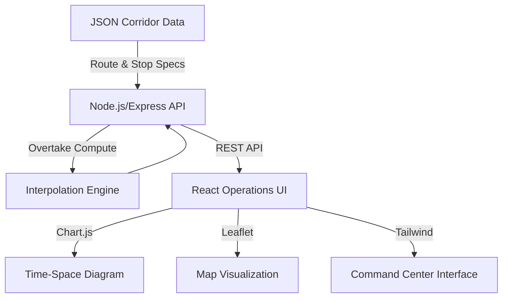

# sl-transit-tracker — Sri Lanka Transit Operations Center

A production-grade, full-stack transit operations and simulation platform designed to unify fragmented Sri Lankan intercity bus data. This project demonstrates advanced patterns in modern web development, including distance-based linear interpolation for real-time tracking, sophisticated overtake computation, and enterprise-grade API documentation.

## What This Project Demonstrates

*   **Modern Frontend**: React 18 + Vite with role-aware operations layouts, high-fidelity transit dashboards, and interactive Leaflet maps.
*   **Robust Backend**: Node.js/Express API with a high-performance structured JSON data layer and specialized transit computation utilities.
*   **Advanced Simulation**: A custom-built km-based linear interpolation engine for detecting vehicle overtakes and predicting real-time asset positions.
*   **API Governance**: Complete OpenAPI 3.0 (Swagger) integration for standardized endpoint management and interactive documentation.
*   **Performance Analytics**: Multi-layered data visualization comparing Scheduled vs. Actual journey metrics using Chart.js time-space diagrams.
*   **Cloud Native**: Architecture optimized for automated deployment via platforms like Vercel (frontend) and Render (backend).

---

## Core Features

### 1. Operations and Live Simulation
*   **Live Asset Tracking**: Visualizes bus positions on an interactive Leaflet map using real-time interpolation along route corridors.
*   **Overtake Simulation Engine**: pure-function computation that detects pairwise vehicle interactions across 1km sampled corridor intervals.
*   **Interactive Time-Space Diagrams**: Visualizes the entire route lifecycle, allowing operators to see scheduled paths vs. real-world deviations.

### 2. Transit Performance Analytics
*   **Scheduled vs. Actual Tracking**: Seamless integration of recorded journey data with optimistic UI overlays for instant delay analysis.
*   **Delay Segment Profiling**: Identifies specific road segments where time was lost (e.g., "Heavy traffic after Puttalam") using dashed overlay line-markers on charts.
*   **Timetable Intelligence**: Instant access to searchable intercity timetables across multiple vehicle classes (Luxury, Semi-Luxury, etc.).

### 3. API Governance & Security
*   **Standardized Documentation**: Fully managed OpenAPI 3.0 specs available via the `/api-docs` Swagger portal.
*   **Modular API Architecture**: Versioned-ready endpoints for routes, fleet journeys, and overtake calculations.
*   **Security & Hardening**: Implemented CORS policies and standardized error handling across the Express middleware stack.

---

## Tech Stack

### Frontend
*   **Framework**: React 18 (Vite)
*   **Styling**: Tailwind CSS
*   **Visualizations**: Chart.js (Time-Space Diagrams), React-Leaflet (GIS)
*   **Routing**: React Router DOM

### Backend
*   **Runtime**: Node.js, Express
*   **Data Layer**: Structured JSON (Flat-file Corridor DB)
*   **Documentation**: Swagger UI, YAML
*   **Utilities**: Custom Linear Interpolation Engine

### Deployment & Infrastructure
*   **Cloud Platforms**: Vercel, Render
*   **CI/CD**: Optimized for GitHub Actions / Automated cloud deployments

---

## System Architecture



---

## Local Setup

### 1. Backend
```bash
cd backend
npm install
npm run dev
```
*API runs at `http://localhost:4000`. Swagger docs at `/api-docs`.*

### 2. Frontend
```bash
cd frontend
npm install
npm run dev
```
*UI runs at `http://localhost:5173`.*

---

## Future Roadmap
- [ ] **IoT Integration**: WebSocket-based real-time GPS telemetry for live bus positions.
- [ ] **AI Forecasting**: Predictive delay analysis using historical traffic patterns.
- [ ] **Multi-Corridor Expansion**: Scaling to Kandy, Galle, and Matara transit lines.
- [ ] **Passenger Companion**: Mobile-first PWA for crowdsourced delay updates.

---

**Developed with ❤️ by [Branavan](https://github.com/Branavan2004)**
